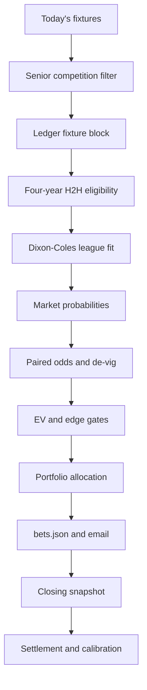
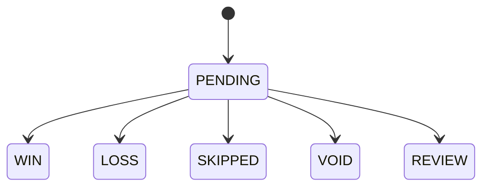

# Architecture and mathematical contract

## Runtime flow

## Dixon–Coles model

For home team `i` and away team `j`:

\[
\lambda_{ij}=\exp(\mu+h+\alpha_i+\delta_j),\qquad
\nu_{ij}=\exp(\mu+\alpha_j+\delta_i)
\]

The score likelihood is the product of two Poisson probabilities multiplied by the Dixon–Coles low-score correction `τ(x,y,λ,ν,ρ)`. The fitted likelihood uses:

\[
w_m=\exp(-\xi\,t_m),\qquad \xi=0.0015
\]

where `t_m` is age in days. Attack strengths are constrained to sum to zero through parameterization; ridge regularization stabilizes sparse leagues. Model fitting excludes every fixture at or after the prediction timestamp.

## Market probabilities

The normalized score matrix gives:

\[
P(O2.5)=\sum_{x+y\ge3}P(x,y),\quad
P(U2.5)=1-P(O2.5),\quad
P(GG)=\sum_{x\ge1,y\ge1}P(x,y)
\]

## H2H eligibility

H2H is not treated as the model probability. For market `k`:

\[
r_k=\frac{\sum_m w_m I_{mk}}{\sum_m w_m}
\]

The market is eligible only when `r_k >= 0.75`. Effective sample size is stored as:

\[
N_{eff}=\frac{(\sum_m w_m)^2}{\sum_m w_m^2}
\]

This prevents the weighted hit rate from being misrepresented as five equally informative observations.

## Market comparison

For offered target odds `O` and opposite-side odds `O_c` from the same bookmaker:

\[
p_{mkt}=\frac{1/O}{1/O+1/O_c}
\]

Pairs with negative overround or overround above 20% are rejected before value comparison.

The calibrated model probability is reduced by a configurable uncertainty haircut:

\[
p_d=\max(0,p_{cal}-0.03)
\]

A candidate must satisfy:

\[
EV=p_dO-1\ge0.05
\]

and

\[
p_d-p_{mkt}\ge0.03
\]

No comparison mixes bookmakers, and the highest-EV eligible market is the only market retained per fixture.

## Staking and exposure

Full Kelly is:

\[
f^*=\frac{p_dO-1}{O-1}
\]

The engine uses `0.25 f*`, caps a position at 1% bankroll, rounds down to the configured stake step, and never forces a minimum stake when calculated stake is smaller. Daily and open-position caps are enforced cumulatively.

Drawdown is calculated from the chronological equity curve relative to its prior peak, including wins and losses. It is not the sum of recent losing tickets.

## Ledgers

`bets.json` is the immutable decision ledger apart from valid state transitions and closing/result enrichment. `predictions.json` is the calibration ledger. Writes use atomic file replacement. GitHub workflows serialize state mutations through the `quantbet-ledger` concurrency group. After a committed state change, the writer explicitly dispatches `pages.yml`; that workflow publishes a minimal static artifact containing only the dashboard and public ledger files.

Allowed bet transitions:

## Known launch boundary

This architecture makes generation reproducible and auditable; it does not prove profitable expected value. Profitability requires timestamp-correct historical odds, walk-forward performance, stable calibration, positive CLV and uncertainty bounds that survive league/time segmentation.
