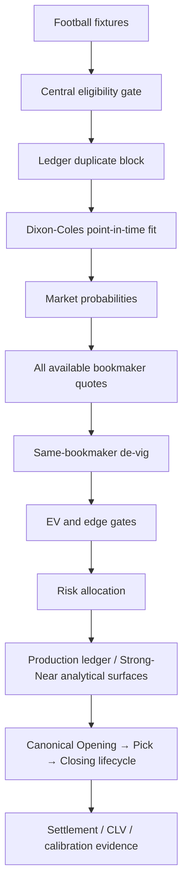
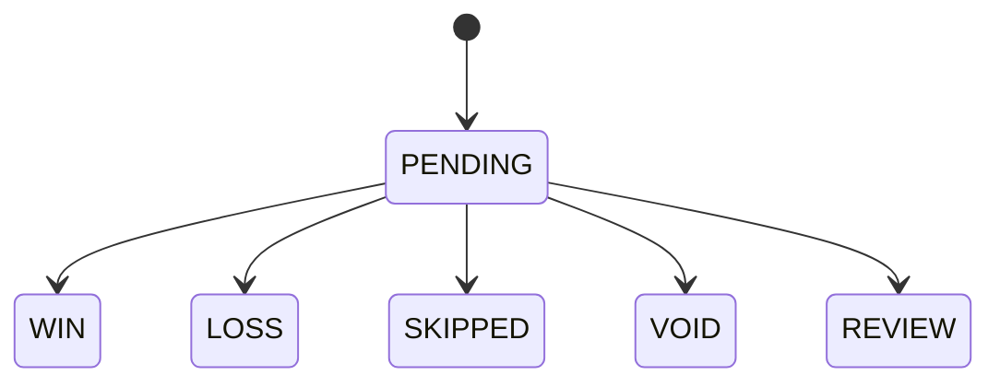

# Architecture and mathematical contract

## Runtime flow

**H2H is not part of this Production flow.** Historical H2H artifacts may exist for research/provenance, but they do not determine Production eligibility, probability, EV, edge, stake or selection.

## Dixon–Coles model

For home team `i` and away team `j`:

\[
\lambda_{ij}=\exp(\mu+h+\alpha_i+\delta_j),\qquad
\nu_{ij}=\exp(\mu+\alpha_j+\delta_i)
\]

The score likelihood is the product of two Poisson probabilities multiplied by the Dixon–Coles low-score correction `τ(x,y,λ,ν,ρ)`. The fitted likelihood uses time-decay weighting, sum-zero attack/defense parameterization and ridge regularization. Model fitting excludes every fixture at or after the prediction timestamp.

## Market probabilities

The normalized score matrix gives:

\[
P(O2.5)=\sum_{x+y\ge3}P(x,y),\quad
P(U2.5)=1-P(O2.5),\quad
P(GG)=\sum_{x\ge1,y\ge1}P(x,y)
\]

## Odds and market comparison

Before Pick, the odds observation layer considers all valid supported bookmaker quotes returned by the provider. Production selection does not use a hard-coded bookmaker shortlist as a coverage filter.

For offered target odds `O` and opposite-side odds `O_c` from the same bookmaker:

\[
p_{mkt}=\frac{1/O}{1/O+1/O_c}
\]

Pairs with negative overround or overround above 20% are rejected before value comparison.

The calibrated model probability is reduced by the configured uncertainty haircut:

\[
p_d=\max(0,p_{cal}-0.03)
\]

A candidate must satisfy the configured EV and probability-edge thresholds. The exact Production Pick bookmaker and observation are retained immutably; later lifecycle observations remain tied to that identity.

## Staking and exposure

Full Kelly is:

\[
f^*=\frac{p_dO-1}{O-1}
\]

The engine uses the configured fractional Kelly policy, per-bet cap, daily/open exposure limits, stake-step rules and drawdown protections. There is no artificial fixed daily Production pick count.

## Canonical lifecycle

For an exact fixture + market + selection + bookmaker identity:

- **Opening** = earliest valid observed pre-Pick quote;
- **Pick** = exact decision-entry observation;
- **Closing** = canonical final valid pre-kickoff observation under the closing contract;
- **CLV** = computed only when the required Pick and Closing evidence exists.

Post-kickoff observations can never become Closing. Missing stages remain explicitly unavailable. Pick must never be copied into Opening, and another bookmaker must never substitute for the Pick bookmaker's lifecycle.

## Ledgers and accounting boundaries

`bets.json` is the Production decision ledger, apart from valid state transitions and lifecycle/result enrichment. `predictions.json` is the calibration ledger. Strong Signals and Near Misses are separate analytical surfaces and cannot alter Production bankroll, P/L or risk accounting.

Writes use atomic file replacement. Football state writers are serialized through the repository's canonical concurrency/quota controls. Immutable Production decision packets preserve the decision-time evidence and configuration identity needed for reconstruction.

Allowed Production bet transitions:

## Observability authorities

- **Eligibility:** one central Football eligibility gate.
- **API quota:** one global Football quota governor.
- **Odds lifecycle:** one canonical Opening/Pick/Closing resolver.
- **Decision provenance:** immutable Production decision packet.
- **Signal classification:** Strong Signal / Near Miss observational classification, isolated from Production accounting.
- **Dashboard:** derived from persisted canonical public data; browser does not call the provider API.

### Canonical Strong/Near writer ownership

`watchlist.yml` is the **only scheduled producer** for Strong Signals, Near Misses, market-timing observations and `intraday_watchlist_state.json`.

`settlement-watchdog.yml` is settlement/recovery-only. It must not invoke `main.py watchlist` and must not write Strong/Near state. Manual recovery uses the same canonical watchlist workflow rather than a second signal-producing path.

The canonical writer persists `watchlist_run_meta.json` with producer identity, GitHub run ID/attempt, source SHA and UTC generation time. Before publication, a candidate writer compares its run ID with the currently published marker and fails closed if it is older or if the existing marker is malformed. After a concurrent push race, the same check is repeated against `origin/main` before any rebase; an older writer is rejected rather than rebasing stale state over a newer signal snapshot.

Canonical outputs and owners:

| Output | Authoritative producer | Boundary |
| --- | --- | --- |
| `intraday_watchlist_state.json` | `watchlist.yml` | Signal observation state |
| `intraday_alerts.json` | `watchlist.yml` | Strong/Near virtual observations |
| `strong_signal_ledger.json` | `watchlist.yml` + public bucket builder | Strong signal history |
| `near_misses.json` | `watchlist.yml` + public bucket builder | Near-miss history |
| `market_timing_metrics.json` | `watchlist.yml` | Market timing observations |
| `data/intraday_signal_events.jsonl` | `watchlist.yml` | Signal-class transitions |
| `watchlist_run_meta.json` | `watchlist.yml` | Writer provenance/ordering authority |

This is an observability/control-plane contract. It does not change Strong Signal thresholds, virtual-accounting semantics, Production settlement or lifecycle mathematics.

## Research boundary

Research datasets and experiments may contain historical H2H material or future Model V2 features. Such material is not Production input unless promoted through the explicit research-to-production gate.

## Known launch boundary

This architecture makes generation and decision provenance auditable; it does not prove profitable expected value. Production readiness requires operational evidence, sufficient timestamp-correct out-of-sample data, stable calibration, lifecycle/CLV coverage and uncertainty-aware performance review.
